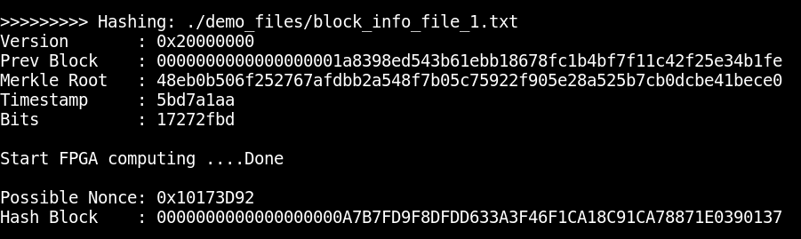

# Bitcoin Block Mining Test Program
This design demonstrates Bitcoin mining using Intel Arria 10 SoC FPGA. The ARM processor reads block information given by user and completes a pre-computing of hash. The FPGA receives init data and finishes rest of computation with all possible nonces to produce hash blocks. For simplicity any produced block has 32-bit leading zeros is considered to be valid therefore the corresponding nonce will be collected and sent back to processor. The FPGA contains 7 fully pipelined computing engines and is able to complete job in less than 4 seconds.
 
 

Algorithm
------
[Block Hashing Algorithm](https://en.bitcoin.it/wiki/Block_hashing_algorithm)
 
 

Platform
------
[Intel Arria 10 SoC Development Kit](https://www.intel.com/content/www/us/en/programmable/products/boards_and_kits/dev-kits/altera/arria-10-soc-development-kit.html)
 
 

HowTo
------
1. Extract a10soc_btc_sd_prebuilt4g.tar.xz to get the image file then write it to a Micro SD card (>=4GB) using dd in linux or Win32DiskImager in windows.
2. Boot Arria 10 SoC Dev Kit and login as root
3. Execute "./a10soc_btc_block_test -f ./demo_files/block_info_file_1.txt"
4. Possible nonce and hash block are reported.
5. Execute "./a10soc_btc_block_test -h" to see the format of input file.
 

Screenshot
------

